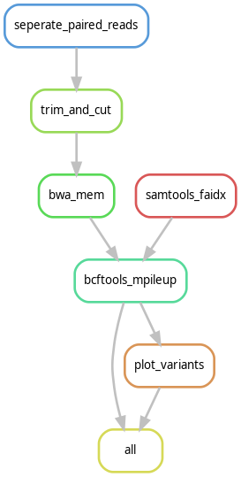

# Dataprocessing_FAST-GBS
Dataprocessing project for converting the FAST-GBS pipeline to a snakemake pipeline.
This is the final assigment for the Data Processing course from the Bioinformatics bachelor program of the [Hanze University of Applied Scieces.](https://www.hanze.nl/nl)

The pipeline performs the following steps:

1. Demultiplexing raw sequencing reads using Sabre.
2. Adapter trimming with CutAdapt.
3. Read mapping with BWA-MEM.
4. Variant calling with BCFTools mpileup, instead of using [Platypus](https://www.rdm.ox.ac.uk/research/lunter-group/lunter-group/platypus-a-haplotype-based-variant-caller-for-next-generation-sequence-data).
5. Visualization of the VCF file with an R-script, here we use the [plot-VCF package](https://github.com/cccnrc/plot-VCF).

## Prerequisites
To run this pipeline, you will need the following software installed.

- [Conda](https://conda.io/projects/conda/en/latest/user-guide/getting-started.html)
- [Snakemake](https://snakemake.readthedocs.io/en/stable/)


## Installation

1. Clone this repository

```
git clone https://github.com/Kyreria/Dataprocessing_FAST-GBS
cd Dataprocessing_FAST-GBS
```

2. Prerequisites for running the pipeline.

To run the pipeline, make sure that you have conda installed with mamba.
This can otherwise be done by using the following commands.

```
conda activate base
conda install -n base -c conda-forge mamba
```

## Configuration

The pipeline is configured with the `config/config.yml` file.
Please use this file to adjust any necessary settings.

- `data_dir`: Path to the directory for the input data.
- `results_dir`: Path to the directory where results will be stored.
- `ref_genome`: genome file name, which must be in the `data_dir`.
- `barcode_file`: Barcode file name, which must also be in `data_dir`
- `ref_genome_ext`: The extension for the reference genome.
- `sample_name`: The name for the sample.
- `sample_ext`: the extension for the sample.
- `type_of_sequence`: The type of sequence, this can be either single or paired.
- `adaptor_sequence`: The adaptor sequence, this is for CutAdapt.
- `output_file_name`: This is for the final output.

## Running the pipeline

Due to the fact that every tool is called upon by using the new wrapper format in Snakemake.
You don't have to make a separate conda environment anymore.

For more information, see the following link: [Snakemake wrappers](https://snakemake-wrappers.readthedocs.io/en/stable/)

To run the snakemake pipeline, simply use the following command:

```
snakemake --cores <number_of_cores> --use-conda
```

You can replace `<number_of_cores>` with the desired number of CPU cores you wish to use.

## Output

This pipeline will generate the following output files in your `results_dir`.

- Demultiplexed FASTQ files
- Trimmed FASTQ files
- Mapped BAM Files
- Variants VCF File
- An R Plot with the variants

## Visualisation of the pipeline using Directed Acyclic Graph (DAG)

To visualize the pipeline, please use the following command:

```snakemake --dag | dot -Tsvg > Images/dag.svg```

This will generate an SVG file called `dag.svg` which can be viewed in an image viewer or on a web browser.

The image is also included below if you do not wish to run the command yourself.

