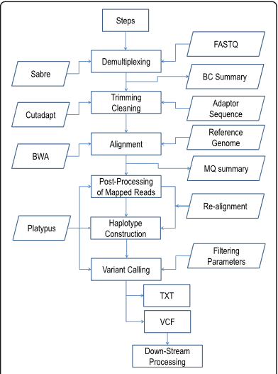
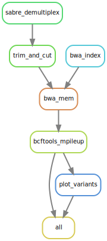

# Dataprocessing_FAST-GBS

# Table of Contents
1. [Overview](#overview)
   - [This Project](#this-project)
   - [Original Pipeline](#original-pipeline)
   - [Differences](#differences-compared-to-the-original-pipeline)
2. [Getting Started](#getting-started)
   - [Prerequisites](#prerequisites)
   - [Installation](#installation)
   - [Configuration](#configuration)
   - [Running the pipeline](#running-the-pipeline)
   - [Output](#output)
3. [Visualization of the pipeline](#visualisation-of-the-pipeline-using-directed-acyclic-graph-dag)
   - [Pipeline steps](#pipeline-steps)
   - [Result visualization](#result-visualization)
4. [License](#license)
5. [Acknowledgements / Resources](#acknowledgements--resources-)


## Overview
### This project

This project focusses on the analysis of genomic data to identify gene variants from FAST-GBS data.
Making use of a suite of bioinformatic tools, Python and R for data visualization, 
to allow the pipeline to process raw sequencing reads using Sabre, perform quality control with Cutadapt,
map the reads against a provided reference genome with BWA mem & samtools,
after calling the variants using bcftools, 
and then finally visualize the amount of variants per chromosome using R.

Next to that this dataprocessing project for converting the FAST-GBS pipeline to a snakemake pipeline,
is also the final assigment for the Data Processing course from the Bioinformatics bachelor program of the [Hanze University of Applied Scieces.](https://www.hanze.nl/nl)


## Original pipeline:
The article [1] describes a new pipeline for the efficient and highly accurate calling/detecting of
SNPs from genotyping-by-sequencing data, otherwise known as GBS-data.



### Differences compared to the original pipeline:

The new pipeline diverges from the pipeline used/described in the original article in several ways.
Most notably is the dissapearance of using Platypus to call the variants.
This was replaced by using bcftools mpileup instead,
This was necessary due to the fact that Platypus was build on Python 2 still,
next to the fact that it refused to build in a conda environment with Python 2.7.

This version of the pipeline also incorporates a visualization step, which is not available in the original pipeline.


## Getting started
### Prerequisites
To run this pipeline, you will need the following software installed.
- Unix-based system (Linux, macOS)
- [Conda](https://conda.io/projects/conda/en/latest/user-guide/getting-started.html), version 23.7.4
- [Python](https://www.python.org/), version 3.12
- [R](https://www.r-project.org/), version 4.4
- [Snakemake](https://snakemake.readthedocs.io/en/stable/), version 8.18.2
- [Sabre](https://github.com/najoshi/sabre), version 1.000
- [Cutadapt](https://github.com/marcelm/cutadapt), version 4.9
- [BWA](https://github.com/lh3/bwa), version 0.7.18
- [Samtools](https://github.com/samtools/samtools), version 1.20
- [bcftools](https://github.com/samtools/bcftools), version 1.20


### Installation

1. Clone this repository

```bash
git clone https://github.com/Kyreria/Dataprocessing_FAST-GBS
cd Dataprocessing_FAST-GBS
```

2. Prerequisites for running the pipeline.

To run the pipeline,
please make use of the conda_enviroment.yml under `Resources/Conda_Environment`
to install the necessary conda environment.
This can be done by using the following commands.

The commands are assuming you're in the `Dataprocessing_FAST-GBS` folder, the root of the project.
```bash
conda env create -f Resources/Conda_Environment/dataprocessing_environment.yml
```

You can then activate the environment running the following:
```bash
conda activate dataprocessing
```

3. Exiting the conda environment.

If you're done with the conda environment and wish to revert back to your base system settings,
please use the following command:
```bash
conda deactivate
```

### Configuration

The pipeline is configured with the `config/config.yml` file.
Please use this file to adjust any necessary settings.

- `data_dir`: Path to the directory for the input data.
- `results_dir`: Path to the directory where results will be stored.
- `barcode_file`: Barcode file name, which must also be in `data_dir`
- `ref_genome`: genome file name, which must be in the `data_dir`.
- `ref_genome_ext`: The extension for the reference genome.
- `sample_name`: The name for the sample.
- `sample_ext`: the extension for the sample.
- `type_of_sequence`: The type of sequence, this can be either single or paired.
- `adaptor_sequence`: The adaptor sequence(s), this is for CutAdapt trimming.
- `output_file_name`: This is the file name for the final output.

### Running the pipeline
To run the snakemake pipeline, simply use the following command whilst in the dataprocessing conda environment:

```bash
snakemake --cores <number_of_cores> --snakefile workflow/Snakefile
```

You can replace `<number_of_cores>` with the desired number of CPU cores you wish to use.

### Output

This pipeline will generate the following output files in your `results_dir`.

- Demultiplexed FASTQ files
- Trimmed FASTQ files
- Mapped BAM Files
- Variants VCF File
- An R Plot with the variants


## Pipeline steps
As one can see from the image above,
there are a couple of steps in the pipeline that will be executed, they would be the following:

1. **Sabre Demultiplexing:** Splitting barcoded reads into seperate files.
2. **Cleaning:** Using Cautadapt, remove any adapter sequences, primrs and other unwanted sequences.
3. **Mapping:** Using BWA mem, map the reads to the provided reference genome.
4. **Variant calling:** Making use of the bcftools mpileup, call the variants.
5. **Variant visualization:** Plot the variants using the [plot-VCF package](https://github.com/cccnrc/plot-VCF).

### Visualisation of the pipeline using Directed Acyclic Graph (DAG)

To visualize the pipeline, please use the following command:

```bash
snakemake --dag | dot -Tsvg > Images/dag.svg
```

This will generate an SVG file called `dag.svg` which can be viewed in an image viewer or on a web browser.

The image is also included below if you do not wish to run the command yourself.



### Visualization
The visualization step should produce a Manhattan like styled VCF plot that's ordered on the chromosomes.

On the graph you would be able to see the amount of variants for each chromosome.


## License
This project is licensed under the GPL-3.0 license - see the LICENSE.md file for details.

## Acknowledgements / Resources 
- [1] Tools and libraries: Conda, Python, R, Snakemake, Sabre, Cutadapt, BWA, Samtools, and bcftools.

- Data sources:
  - [1] **Article**: [Link to Article](https://bmcbioinformatics.biomedcentral.com/counter/pdf/10.1186/s12859-016-1431-9.pdf)